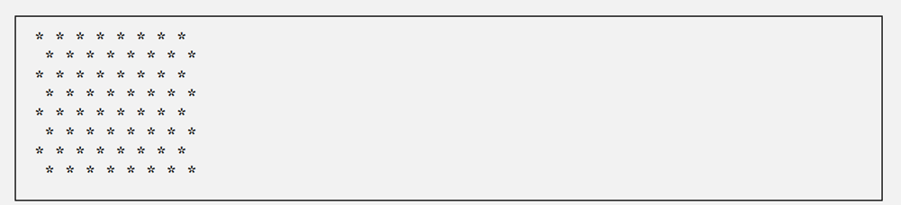

````markdown
---

## Chapter 2
 
### Self-Review Exercises
 
**2.1 Fill in the blanks in each of the following statements:**
 
a) A(n) **{ (left brace)** begins the body of every method, and a(n) **} (right brace)** ends the body of every method.
b) You can use the **if** statement to make decisions.
c) **//** begins an end-of-line comment.
d) **Space characters**, **tabs** and **newlines (or blank lines)** are called white space.
e) **Keywords (or reserved words)** are reserved for use by Java.
f) Java applications begin execution at method **main**.
g) Methods **System.out.print**, **System.out.println** and **System.out.printf** display information in a command window.
 
---

**2.2 State whether each of the following is true or false. If false, explain why.**
 
a) Comments cause the computer to print the text after the // on the screen when the program executes.
> **False.** Comments are ignored by the compiler and do not perform any action. They are for human readers to understand the code.
 
b) All variables must be given a type when they’re declared.
> **True.**
 
c) Java considers the variables number and NuMbEr to be identical.
> **False.** Java is case-sensitive, so `number` and `NuMbEr` are two different variables.
 
d) The remainder operator (%) can be used only with integer operands.
> **False.** The remainder operator can also be used with floating-point numbers (e.g., `double`).
 
e) The arithmetic operators \*, /, %, + and - all have the same level of precedence.
> **False.** The operators \*, /, and % have a higher level of precedence than + and -.
 
---

**2.3 Write statements to accomplish each of the following tasks:**
 
a) Declare variables c, thisIsAVariable, q76354 and number to be of type int.
```java
int c, thisIsAVariable, q76354, number;
````

b) Prompt the user to enter an integer.

```java
System.out.print("Enter an integer: ");
```

c) Input an integer and assign the result to int variable value. Assume Scanner variable input can be used to read a value from the keyboard.

```java
int value = input.nextInt();
```

d) Print "This is a Java program" on one line in the command window. Use method System.out.println.

```java
System.out.println("This is a Java program");
```

e) Print "This is a Java program" on two lines in the command window. The first line should end with Java. Use method System.out.printf and two %s format specifiers.

```java
System.out.printf("%s%n%s%n", "This is a Java", "program");
```

f) If the variable number is not equal to 7, display "The variable number is not equal to 7”

```java
if (number != 7) {
    System.out.println("The variable number is not equal to 7");
}
```

-----

**2.4 Identify and correct the errors in each of the following statements:**

a) `if (c < 7); System.out.println("c is less than 7");`

> **Error:** The semicolon (`;`) after the `if` condition creates an empty statement. The `System.out.println` will *always* execute, regardless of the condition.
> **Correction:** Remove the semicolon.
>
> ```java
> if (c < 7) {
>     System.out.println("c is less than 7");
> }
> ```

b) `if (c => 7) System.out.println("c is equal to or greater than 7");`

> **Error:** The operator `=>` is not a valid Java operator.
> **Correction:** The "greater than or equal to" operator is `>=`.
>
> ```java
> if (c >= 7) {
>     System.out.println("c is equal to or greater than 7");
> }
> ```

-----

**2.5 Write declarations, statements or comments that accomplish each of the following tasks:**

a) State that a program will calculate the product of three integers.

```java
// This program calculates the product of three integers.
```

b) Create a Scanner called input that reads values from the standard input.

```java
import java.util.Scanner;
Scanner input = new Scanner(System.in);
```

c) Declare the variables x, y, z and result to be of type int.

```java
int x, y, z, result;
```

d) Prompt the user to enter the first integer.

```java
System.out.print("Enter first integer: ");
```

e) Read the first integer from the user and store it in the variable x.

```java
x = input.nextInt();
```

f) Prompt the user to enter the second integer.

```java
System.out.print("Enter second integer: ");
```

g) Read the second integer from the user and store it in the variable y.

```java
y = input.nextInt();
```

h) Prompt the user to enter the third integer.

```java
System.out.print("Enter third integer: ");
```

i) Read the third integer from the user and store it in the variable z.

```java
z = input.nextInt();
```

j) Compute the product of the three integers contained in variables x, y and z, and assign the result to the variable result.

```java
result = x * y * z;
```

k) Use System.out.printf to display the message "Product is" followed by the value of the variable result.

```java
System.out.printf("Product is %d%n", result);
```

-----

**2.6 Using the statements you wrote in Exercise 2.5, write a complete program that calculates and prints the product of three integers.**

```java
import java.util.Scanner; // Program uses class Scanner

public class Product {
    public static void main(String[] args) {
        // This program calculates the product of three integers.
        
        // Create a Scanner called input that reads values from the standard input.
        Scanner input = new Scanner(System.in);
        
        // Declare the variables x, y, z and result to be of type int.
        int x, y, z, result;
        
        // Prompt the user to enter the first integer.
        System.out.print("Enter first integer: ");
        // Read the first integer from the user and store it in the variable x.
        x = input.nextInt();
        
        // Prompt the user to enter the second integer.
        System.out.print("Enter second integer: ");
        // Read the second integer from the user and store it in the variable y.
        y = input.nextInt();
        
        // Prompt the user to enter the third integer.
        System.out.print("Enter third integer: ");
        // Read the third integer from the user and store it in the variable z.
        z = input.nextInt();
        
        // Compute the product and assign the result to the variable result.
        result = x * y * z;
        
        // Display the message "Product is" followed by the value of result.
        System.out.printf("Product is %d%n", result);
        
        input.close(); // Close the scanner
    }
}
```

-----

## Exercises

**2.7 Fill in the blanks in each of the following statements:**

a) **Comments** are used to document a program and improve its readability.
b) A decision can be made in a Java program with a(n) **if statement**.
c) Calculations are normally performed by **assignment statements**.
d) The arithmetic operators with the same precedence as multiplication are **division (/)** and **remainder (%)**.
e) When parentheses in an arithmetic expression are nested, the **innermost** set of parentheses is evaluated first.
f) A location in the computer’s memory that may contain different values at various times throughout the execution of a program is called a(n) **variable**.

-----

**2.8 Write Java statements that accomplish each of the following tasks:**

a) Display the message "Enter an integer: ", leaving the cursor on the same line.

```java
System.out.print("Enter an integer: ");
```

b) Assign the product of variables b and c to variable a.

```java
a = b * c;
```

c) Use a comment to state that a program performs a sample payroll calculation.

```java
// This program performs a sample payroll calculation.
```

-----

**2.9 State whether each of the following is true or false. If false, explain why.**

a) Java operators are evaluated from left to right.

> **False.** Operators are evaluated based on their **precedence** and **associativity**. For example, multiplication has higher precedence than addition.

b) The following are all valid variable names: \_under\_bar\_, m928134, t5, j7, her\_sales$, his\_$account\_total, a, b$, c, z and z2.

> **True.** (Note: While `$` is technically allowed, its use is discouraged as it's reserved for auto-generated names.)

c) A valid Java arithmetic expression with no parentheses is evaluated from left to right.

> **False.** It is evaluated according to operator **precedence** first (e.g., `*`, `/`, `%` before `+`, `-`), and then by associativity (left-to-right for these operators).

d) The following are all invalid variable names: 3g, 87, 67h2, h22 and 2h.

> **False.** `h22` is a **valid** variable name. The others are invalid because they begin with a digit.

-----

**2.10 Assuming that x=2 and y=3, what does each of the following statements display?**

a) `System.out.printf("x = %d%n", x);`

> `x = 2`

b) `System.out.printf("Value of %d + %d is %d%n", x, x, (x + x));`

> `Value of 2 + 2 is 4`

c) `System.out.printf("x =");`

> `x =`
> (with no newline)

d) `System.out.printf("%d = %d%n", (x + y), (y + x));`

> `5 = 5`

-----

**2.11 Which of the following Java statements contain variables whose values are modified?**

a) `p = i + j + k + 7;`
b) `System.out.println("variables whose values are modified");`
c) `System.out.println("a = 5");`
d) `value = input.nextInt();`

> **a)** and **d)**.
> In (a), the variable `p` is modified.
> In (d), the variable `value` is modified.

-----

**2.12 Given that y = ax³ + 7, which of the following are correct Java statements for this equation?**

a) `y = a * x * x * x + 7;`
b) `y = a * x * x * (x + 7);`
c) `y = (a * x) * x * (x + 7);`
d) `y = (a * x) * x * x + 7;`
e) `y = a * (x * x * x) + 7;`
f) `y = a * x * (x * x + 7);`

> **a)**, **d)**, and **e)** are all correct.

-----

**2.13 State the order of evaluation of the operators in each of the following Java statements, and show the value of x after each statement is performed:**

a) `x = 7 + 3 * 6 / 2 - 1;`

> 1.  `*` (multiplication): `3 * 6 = 18`
> 2.  `/` (division): `18 / 2 = 9`
> 3.  `+` (addition): `7 + 9 = 16`
> 4.  `-` (subtraction): `16 - 1 = 15`
>     **Final value of x is 15.**

b) `x = 2 % 2 + 2 * 2 - 2 / 2;`

> 1.  `%` (remainder): `2 % 2 = 0`
> 2.  `*` (multiplication): `2 * 2 = 4`
> 3.  `/` (division): `2 / 2 = 1`
> 4.  `+` (addition): `0 + 4 = 4`
> 5.  `-` (subtraction): `4 - 1 = 3`
>     **Final value of x is 3.**

c) `x = (3 * 9 * (3 + (9 * 3 / (3))));`

> 1.  Innermost `(3)`: 3
> 2.  Innermost `(9 * 3 / 3)`:
>       - `9 * 3 = 27`
>       - `27 / 3 = 9`
> 3.  Next `(3 + 9)`: 12
> 4.  Outermost `(3 * 9 * 12)`:
>       - `3 * 9 = 27`
>       - `27 * 12 = 324`
>         **Final value of x is 324.**

-----

**2.14 Write an application that displays the numbers 1 to 4 on the same line, with each pair of adjacent numbers separated by one space. Use the following techniques:**

a) Use one System.out.println statement.

```java
public class DisplayNumbersA {
    public static void main(String[] args) {
        System.out.println("1 2 3 4");
    }
}
```

b) Use four System.out.print statements.

```java
public class DisplayNumbersB {
    public static void main(String[] args) {
        System.out.print("1 ");
        System.out.print("2 ");
        System.out.print("3 ");
        System.out.print("4\n"); // or System.out.println("4");
    }
}
```

c) Use one System.out.printf statement.

```java
public class DisplayNumbersC {
    public static void main(String[] args) {
        System.out.printf("%d %d %d %d%n", 1, 2, 3, 4);
    }
}
```

-----

**2.15 (Arithmetic) Write an application that asks the user to enter two integers, obtains them from the user and prints their sum, product, difference and quotient (division).**

```java
import java.util.Scanner;

public class Arithmetic {
    public static void main(String[] args) {
        Scanner input = new Scanner(System.in);
        
        int num1, num2;
        
        System.out.print("Enter first integer: ");
        num1 = input.nextInt();
        
        System.out.print("Enter second integer: ");
        num2 = input.nextInt();
        
        int sum = num1 + num2;
        int product = num1 * num2;
        int difference = num1 - num2;
        
        System.out.printf("Sum is %d%n", sum);
        System.out.printf("Product is %d%n", product);
        System.out.printf("Difference is %d%n", difference);

        // Handle division by zero
        if (num2 == 0) {
            System.out.println("Cannot calculate quotient: Division by zero.");
        } else {
            int quotient = num1 / num2;
            System.out.printf("Quotient is %d%n", quotient);
        }
        
        input.close();
    }
}
```

-----

**2.16 (Comparing Integers) Write an application that asks the user to enter two integers, obtains them from the user and displays the larger number followed by the words "is larger". If the numbers are equal, print the message "These numbers are equal".**

```java
import java.util.Scanner;

public class Comparison {
    public static void main(String[] args) {
        Scanner input = new Scanner(System.in);
        
        int num1, num2;
        
        System.out.print("Enter first integer: ");
        num1 = input.nextInt();
        
        System.out.print("Enter second integer: ");
        num2 = input.nextInt();
        
        if (num1 > num2) {
            System.out.printf("%d is larger%n", num1);
        }
        
        if (num2 > num1) {
            System.out.printf("%d is larger%n", num2);
        }
        
        if (num1 == num2) {
            System.out.println("These numbers are equal");
        }
        
        input.close();
    }
}
```

-----

**2.17 (Arithmetic, Smallest and Largest) Write an application that inputs three integers from the user and displays the sum, average, product, smallest and largest of the numbers.**

```java
import java.util.Scanner;

public class Statistics {
    public static void main(String[] args) {
        Scanner input = new Scanner(System.in);
        
        int num1, num2, num3;
        
        System.out.print("Enter first integer: ");
        num1 = input.nextInt();
        System.out.print("Enter second integer: ");
        num2 = input.nextInt();
        System.out.print("Enter third integer: ");
        num3 = input.nextInt();
        
        // Calculations
        int sum = num1 + num2 + num3;
        int average = sum / 3;
        int product = num1 * num2 * num3;
        
        // Find smallest
        int smallest = num1; // Assume first is smallest
        if (num2 < smallest) {
            smallest = num2;
        }
        if (num3 < smallest) {
            smallest = num3;
        }
        
        // Find largest
        int largest = num1; // Assume first is largest
        if (num2 > largest) {
            largest = num2;
        }
        if (num3 > largest) {
            largest = num3;
        }
        
        // Display results
        System.out.printf("Sum is %d%n", sum);
        System.out.printf("Average is %d%n", average);
        System.out.printf("Product is %d%n", product);
        System.out.printf("Smallest is %d%n", smallest);
        System.out.printf("Largest is %d%n", largest);
        
        input.close();
    }
}
```

-----

**2.18 (Displaying Shapes with Asterisks) Write an application that displays a box, an oval, an arrow and a diamond using asterisks (\*).**


```java
public class Shapes {
    public static void main(String[] args) {
        System.out.println("*********");
        System.out.println("* *");
        System.out.println("* *");
        System.out.println("* *");
        System.out.println("* *");
        System.out.println("* *");
        System.out.println("* *");
        System.out.println("* *");
        System.out.println("*********");
        System.out.println();
        
        System.out.println("   *** ");
        System.out.println(" * * ");
        System.out.println("* *");
        System.out.println("* *");
        System.out.println("* *");
        System.out.println("* *");
        System.out.println("* *");
        System.out.println(" * * ");
        System.out.println("   *** ");
        System.out.println();

        System.out.println("  * ");
        System.out.println(" *** ");
        System.out.println("*****");
        System.out.println("  * ");
        System.out.println("  * ");
        System.out.println("  * ");
        System.out.println("  * ");
        System.out.println("  * ");
        System.out.println("  * ");
        System.out.println();

        System.out.println("    * ");
        System.out.println("   * * ");
        System.out.println("  * * ");
        System.out.println(" * * ");
        System.out.println("* *");
        System.out.println(" * * ");
        System.out.println("  * * ");
        System.out.println("   * * ");
        System.out.println("    * ");
    }
}
```

-----

**2.19 What does the following code print?**
`System.out.printf("*%n**%n***%n****%n*****%n");`

```
*
**
***
****
*****
```

-----

**2.20 What does the following code print?**
`System.out.println("*");`
`System.out.println("***");`
`System.out.println("*****");`
`System.out.println("****");`
`System.out.println("**");`

```
*
***
*****
****
**
```

-----

**2.21 What does the following code print?**
`System.out.print("*");`
`System.out.print("***");`
`System.out.print("*****");`
`System.out.print("****");`
`System.out.println("**");`

```
***************
```

*(All on one line, followed by a newline)*

-----

**2.22 What does the following code print?**
`System.out.print("*");`
`System.out.println("***");`
`System.out.println("*****");`
`System.out.print("****");`
`System.out.println("**");`

```
****
*****
******
```

-----

**2.23 What does the following code print?**
`System.out.printf("%s%n%s%n%s%n", "*", "***", "*****");`

```
*
***
*****
```

-----

**2.24 (Largest and Smallest Integers) Write an application that reads five integers and determines and prints the largest and smallest integers in the group.**

```java
import java.util.Scanner;

public class LargestSmallest {
    public static void main(String[] args) {
        Scanner input = new Scanner(System.in);
        
        int n1, n2, n3, n4, n5;
        
        System.out.print("Enter first integer: ");
        n1 = input.nextInt();
        System.out.print("Enter second integer: ");
        n2 = input.nextInt();
        System.out.print("Enter third integer: ");
        n3 = input.nextInt();
        System.out.print("Enter fourth integer: ");
        n4 = input.nextInt();
        System.out.print("Enter fifth integer: ");
        n5 = input.nextInt();
        
        // Initialize smallest and largest with the first number
        int smallest = n1;
        int largest = n1;
        
        // Compare with the second number
        if (n2 < smallest) {
            smallest = n2;
        }
        if (n2 > largest) {
            largest = n2;
        }
        
        // Compare with the third number
        if (n3 < smallest) {
            smallest = n3;
        }
        if (n3 > largest) {
            largest = n3;
        }
        
        // Compare with the fourth number
        if (n4 < smallest) {
            smallest = n4;
        }
        if (n4 > largest) {
            largest = n4;
        }
        
        // Compare with the fifth number
        if (n5 < smallest) {
            smallest = n5;
        }
        if (n5 > largest) {
            largest = n5;
        }
        
        System.out.printf("Smallest integer is: %d%n", smallest);
        System.out.printf("Largest integer is: %d%n", largest);
        
        input.close();
    }
}
```

-----

**2.25 (Odd or Even) Write an application that reads an integer and determines and prints whether it’s odd or even.**

```java
import java.util.Scanner;

public class OddOrEven {
    public static void main(String[] args) {
        Scanner input = new Scanner(System.in);
        
        System.out.print("Enter an integer: ");
        int number = input.nextInt();
        
        if (number % 2 == 0) {
            System.out.printf("%d is even.%n", number);
        }
        
        if (number % 2 != 0) {
            System.out.printf("%d is odd.%n", number);
        }
        
        input.close();
    }
}
```

-----

**2.26 (Multiples) Write an application that reads two integers, determines whether the first is a multiple of the second and prints the result.**

```java
import java.util.Scanner;

public class Multiples {
    public static void main(String[] args) {
        Scanner input = new Scanner(System.in);
        
        System.out.print("Enter first integer: ");
        int num1 = input.nextInt();
        
        System.out.print("Enter second integer: ");
        int num2 = input.nextInt();
        
        // Check for division by zero
        if (num2 == 0) {
            System.out.println("Cannot check for multiples: second number is zero.");
        } else if (num1 % num2 == 0) {
            System.out.printf("%d is a multiple of %d.%n", num1, num2);
        } else {
            System.out.printf("%d is not a multiple of %d.%n", num1, num2);
        }
        
        input.close();
    }
}
```

-----

**2.27 (Checkerboard Pattern of Asterisks) Write an application that displays a checkerboard pattern.**


```java
public class Checkerboard {
    public static void main(String[] args) {
        System.out.println("* * * * * * * *");
        System.out.println(" * * * * * * * *");
        System.out.println("* * * * * * * *");
        System.out.println(" * * * * * * * *");
        System.out.println("* * * * * * * *");
        System.out.println(" * * * * * * * *");
        System.out.println("* * * * * * * *");
        System.out.println(" * * * * * * * *");
    }
}
```

-----

**2.28 (Diameter, Circumference and Area of a Circle) Write an application that inputs from the user the radius of a circle as an integer and prints the circle’s diameter, circumference and area using the floating-point value 3.14159 for π.**

```java
import java.util.Scanner;

public class Circle {
    public static void main(String[] args) {
        Scanner input = new Scanner(System.in);
        
        System.out.print("Enter the radius of the circle (as an integer): ");
        int radius = input.nextInt();
        
        // Using 3.14159 as requested
        // System.out.printf("Diameter is %d%n", 2 * radius);
        // System.out.printf("Circumference is %f%n", 2 * 3.14159 * radius);
        // System.out.printf("Area is %f%n", 3.14159 * radius * radius);

        // Using the more precise Math.PI as suggested in the note
        System.out.printf("Diameter is %d%n", 2 * radius);
        System.out.printf("Circumference is %f%n", 2 * Math.PI * radius);
        System.out.printf("Area is %f%n", Math.PI * radius * radius);
        
        input.close();
    }
}
```

-----

**2.29 (Integer Value of a Character) Write an application that displays the integer equivalents of some uppercase letters, lowercase letters, digits and special symbols. Display the integer equivalents of the following: A B C a b c 0 1 2 $ \* + / and the blank character.**

```java
public class CharacterValues {
    public static void main(String[] args) {
        System.out.printf("The character %c has the value %d%n", 'A', ((int) 'A'));
        System.out.printf("The character %c has the value %d%n", 'B', ((int) 'B'));
        System.out.printf("The character %c has the value %d%n", 'C', ((int) 'C'));
        System.out.printf("The character %c has the value %d%n", 'a', ((int) 'a'));
        System.out.printf("The character %c has the value %d%n", 'b', ((int) 'b'));
        System.out.printf("The character %c has the value %d%n", 'c', ((int) 'c'));
        System.out.printf("The character %c has the value %d%n", '0', ((int) '0'));
        System.out.printf("The character %c has the value %d%n", '1', ((int) '1'));
        System.out.printf("The character %c has the value %d%n", '2', ((int) '2'));
        System.out.printf("The character %c has the value %d%n", '$', ((int) '$'));
        System.out.printf("The character %c has the value %d%n", '*', ((int) '*'));
        System.out.printf("The character %c has the value %d%n", '+', ((int) '+'));
        System.out.printf("The character %c has the value %d%n", '/', ((int) '/'));
        System.out.printf("The character %c has the value %d%n", ' ', ((int) ' '));
    }
}
```

-----

**2.30 (Separating the Digits in an Integer) Write an application that inputs one number consisting of five digits from the user, separates the number into its individual digits and prints the digits separated from one another by three spaces each. For example, if the user types in the number 42339, the program should print**


```java
import java.util.Scanner;

public class DigitExtractor {
    public static void main(String[] args) {
        Scanner input = new Scanner(System.in);
        
        System.out.print("Enter a five-digit number: ");
        int number = input.nextInt();
        
        // Check if it's a 5-digit number (optional but good practice)
        if (number < 10000 || number > 99999) {
            System.out.println("Error: Please enter a five-digit number.");
        } else {
            // "Pick off" each digit using / and %
            int digit1 = number / 10000;
            int digit2 = (number % 10000) / 1000;
            int digit3 = (number % 1000) / 100;
            int digit4 = (number % 100) / 10;
            int digit5 = number % 10;
            
            // Print them with three spaces
            System.out.printf("%d   %d   %d   %d   %d%n", 
                digit1, digit2, digit3, digit4, digit5);
        }
        
        input.close();
    }
}
```

> **What happens with more than five digits?** Example: 123456.
> `digit1` becomes `12`. The output would be: `12   3   4   5   6`
> **What happens with fewer than five digits?** Example: 123.
> `digit1` becomes `0`. `digit2` becomes `0`. `digit3` becomes `1`. The output would be: `0   0   1   2   3`

-----

**2.31 (Table of Squares and Cubes) Write an application that calculates the squares and cubes of the numbers from 0 to 10 and prints the resulting values in table format.**


```java
public class TableOfSquaresAndCubes {
    public static void main(String[] args) {
        System.out.println("number\tsquare\tcube");
        System.out.printf("%d\t%d\t%d%n", 0, 0*0, 0*0*0);
        System.out.printf("%d\t%d\t%d%n", 1, 1*1, 1*1*1);
        System.out.printf("%d\t%d\t%d%n", 2, 2*2, 2*2*2);
        System.out.printf("%d\t%d\t%d%n", 3, 3*3, 3*3*3);
        System.out.printf("%d\t%d\t%d%n", 4, 4*4, 4*4*4);
        System.out.printf("%d\t%d\t%d%n", 5, 5*5, 5*5*5);
        System.out.printf("%d\t%d\t%d%n", 6, 6*6, 6*6*6);
        System.out.printf("%d\t%d\t%d%n", 7, 7*7, 7*7*7);
        System.out.printf("%d\t%d\t%d%n", 8, 8*8, 8*8*8);
        System.out.printf("%d\t%d\t%d%n", 9, 9*9, 9*9*9);
        System.out.printf("%d\t%d\t%d%n", 10, 10*10, 10*10*10);
    }
}
```

-----

**2.32 (Negative, Positive and Zero Values) Write a program that inputs five numbers and determines and prints the number of negative numbers input, the number of positive numbers input and the number of zeros input.**

```java
import java.util.Scanner;

public class NumberClassifier {
    public static void main(String[] args) {
        Scanner input = new Scanner(System.in);
        
        int positives = 0;
        int negatives = 0;
        int zeros = 0;
        
        int n1, n2, n3, n4, n5;
        
        System.out.print("Enter first integer: ");
        n1 = input.nextInt();
        System.out.print("Enter second integer: ");
        n2 = input.nextInt();
        System.out.print("Enter third integer: ");
        n3 = input.nextInt();
        System.out.print("Enter fourth integer: ");
        n4 = input.nextInt();
        System.out.print("Enter fifth integer: ");
        n5 = input.nextInt();
        
        // Classify first number
        if (n1 > 0) positives = positives + 1;
        if (n1 < 0) negatives = negatives + 1;
        if (n1 == 0) zeros = zeros + 1;
        
        // Classify second number
        if (n2 > 0) positives = positives + 1;
        if (n2 < 0) negatives = negatives + 1;
        if (n2 == 0) zeros = zeros + 1;
        
        // Classify third number
        if (n3 > 0) positives = positives + 1;
        if (n3 < 0) negatives = negatives + 1;
        if (n3 == 0) zeros = zeros + 1;
        
        // Classify fourth number
        if (n4 > 0) positives = positives + 1;
        if (n4 < 0) negatives = negatives + 1;
        if (n4 == 0) zeros = zeros + 1;
        
        // Classify fifth number
        if (n5 > 0) positives = positives + 1;
        if (n5 < 0) negatives = negatives + 1;
        if (n5 == 0) zeros = zeros + 1;
        
        System.out.printf("Number of positive numbers: %d%n", positives);
        System.out.printf("Number of negative numbers: %d%n", negatives);
        System.out.printf("Number of zeros: %d%n", zeros);
        
        input.close();
    }
}
```

-----

### Making a Difference

**2.33 (Body Mass Index Calculator) We introduced the body mass index (BMI) calculator in Exercise 1.10. The formulas for calculating BMI are**


**Create a BMI calculator that reads the user’s weight in pounds and height in inches (or, if you prefer, the user’s weight in kilograms and height in meters), then calculates and displays the user’s body mass index. Also, display the following information from the Department of Health and Human Services/National Institutes of Health so the user can evaluate his/her BMI:** 


**[Note: In this chapter, you learned to use the int type to represent whole numbers. The BMI calculations when done with int values will both produce whole-number results. In Chapter 3, you’ll learn to use the double type to represent numbers with decimal points. When the BMI calculations are performed with doubles, they’ll both produce numbers with decimal points—these are called “floating-point” numbers.]**

```java
import java.util.Scanner;

public class BMICalculator {
    public static void main(String[] args) {
        Scanner input = new Scanner(System.in);
        
        int weightInPounds;
        int heightInInches;
        
        System.out.print("Enter your weight in pounds: ");
        weightInPounds = input.nextInt();
        
        System.out.print("Enter your height in inches: ");
        heightInInches = input.nextInt();
        
        // Calculate BMI using the integer formula
        // BMI = (weightInPounds * 703) / (heightInInches * heightInInches)
        int bmi = (weightInPounds * 703) / (heightInInches * heightInInches);
        
        System.out.printf("Your BMI is: %d%n%n", bmi);
        
        // Display the BMI information
        System.out.println("BMI VALUES");
        System.out.println("Underweight:\tless than 18.5");
        System.out.println("Normal:\t\tbetween 18.5 and 24.9");
        System.out.println("Overweight:\tbetween 25 and 29.9");
        System.out.println("Obese:\t\t30 or greater");
        
        input.close();
    }
}
```

-----

**2.34 (World Population Growth Calculator) Use the web to determine the current world population and the annual world population growth rate. Write an application that inputs these values, then displays the estimated world population after one, two, three, four and five years.**
*(Note: This solution uses `double` for calculations to handle decimals and `long` for population, as it's a very large number. It also hard-codes the values, but you can add a `Scanner` to input them.)*

```java
import java.util.Scanner;

// This problem is best solved with doubles and longs
public class PopulationGrowth {
    public static void main(String[] args) {
        Scanner input = new Scanner(System.in);

        System.out.print("Enter the current world population: ");
        long currentPopulation = input.nextLong(); 
        
        System.out.print("Enter the annual world population growth rate (e.g., 0.009 for 0.9%): ");
        double growthRate = input.nextDouble();
        
        // Calculate future populations
        double popYear1 = currentPopulation * (1.0 + growthRate);
        double popYear2 = popYear1 * (1.0 + growthRate);
        double popYear3 = popYear2 * (1.0 + growthRate);
        double popYear4 = popYear3 * (1.0 + growthRate);
        double popYear5 = popYear4 * (1.0 + growthRate);

        System.out.printf("Current population: %d%n", currentPopulation);
        System.out.printf("Annual growth rate: %.1f%%%n", growthRate * 100);
        System.out.println();
        System.out.printf("Estimated population after 1 year: %.0f%n", popYear1);
        System.out.printf("Estimated population after 2 years: %.0f%n", popYear2);
        System.out.printf("Estimated population after 3 years: %.0f%n", popYear3);
        System.out.printf("Estimated population after 4 years: %.0f%n", popYear4);
        System.out.printf("Estimated population after 5 years: %.0f%n", popYear5);
        
        input.close();
    }
}
```

-----

**2.35 (Car-Pool Savings Calculator) Create an application that calculates your daily driving cost. The application should input the following information and display the user’s cost per day of driving to work:**
a) Total miles driven per day.
b) Cost per gallon of gasoline.
c) Average miles per gallon.
d) Parking fees per day.
e) Tolls per day.

*(Note: This requires floating-point numbers (`double`) for accurate cost calculation.)*

```java
import java.util.Scanner;

public class CarPoolCalculator {
    public static void main(String[] args) {
        Scanner input = new Scanner(System.in);

        double totalMiles;
        double costPerGallon;
        double avgMilesPerGallon;
        double parkingFees;
        double tolls;

        System.out.print("Enter total miles driven per day: ");
        totalMiles = input.nextDouble();
        
        System.out.print("Enter cost per gallon of gasoline: ");
        costPerGallon = input.nextDouble();
        
        System.out.print("Enter average miles per gallon: ");
        avgMilesPerGallon = input.nextDouble();
        
        System.Fout.print("Enter parking fees per day: ");
        parkingFees = input.nextDouble();
        
        System.out.print("Enter tolls per day: ");
        tolls = input.nextDouble();
        
        // Calculate cost
        double gallonsUsed = totalMiles / avgMilesPerGallon;
        double gasCost = gallonsUsed * costPerGallon;
        double totalCost = gasCost + parkingFees + tolls;
        
        System.out.printf("Your daily driving cost is: $%.2f%n", totalCost);
        
        input.close();
    }
}
```

```
```